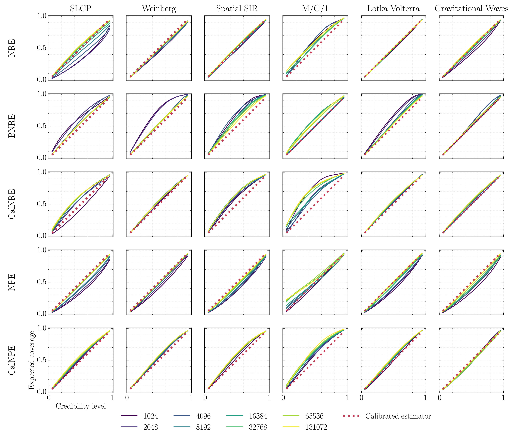

# Calibrating Neural Simulation-Based Inference with Differentiable Coverage Probability

## Abstract
Bayesian inference allows expressing the uncertainty of posterior belief under a probabilistic model given prior information and the likelihood of the evidence. Predominantly, the likelihood function is only implicitly established by a simulator posing the need for simulation-based inference (SBI). However, the existing algorithms can yield overconfident posteriors (Hermans *et al.*, 2022 [1]) defeating the whole purpose of credibility if the uncertainty quantification is inaccurate. We propose to include a calibration term directly into the training objective of the neural model in selected amortized SBI techniques. By introducing a relaxation of the classical formulation of calibration error we enable end-to-end backpropagation. The proposed method is not tied to any particular neural model and brings moderate computational overhead compared to the profits it introduces. It is directly applicable to existing computational pipelines allowing reliable black-box posterior inference. We empirically show on six benchmark problems that the proposed method achieves competitive or better results in terms of coverage and expected posterior density than the previously existing approaches.

[1] Joeri Hermans and Arnaud Delaunoy and François Rozet and Antoine Wehenkel and Volodimir Begy and Gilles Louppe.
A Crisis In Simulation-Based Inference? Beware, Your Posterior Approximations Can Be Unfaithful. Transactions on Machine Learning Research, 2022.


A PDF render of the manuscript is available on [`arXiv`](http://arxiv.org/abs/2310.13402).




## Demo

See [demo.ipynb](demo.ipynb) for a demo of the proposed method.

## Reproducing the experiments
First, build the `calibrated-posterior` conda environment using [conda/use-env.sh](conda/use-env.sh) script. The pipelines performing all the experiments can then be executed by running the following commands
```
CONDA_DEFAULT_ENV="calibrated-posterior" bash ./experiments/scripts/run-calnre.sh
CONDA_DEFAULT_ENV="calibrated-posterior" bash ./experiments/scripts/run-calnpe.sh
```
If executed on a slurm cluster, those pipelines will dispatch the experiments into different jobs. The results can then be visualized in the [workflows/calnre/results.ipynb](workflows/calnre/results.ipynb) notebook.

It may be required to increase system stack size by running `ulimit -s 32568`.

## License

Described in the [LICENSE](LICENSE) file.


This repository is based on [balanced-nre](https://github.com/montefiore-ai/balanced-nre) repository.
